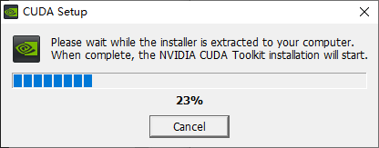
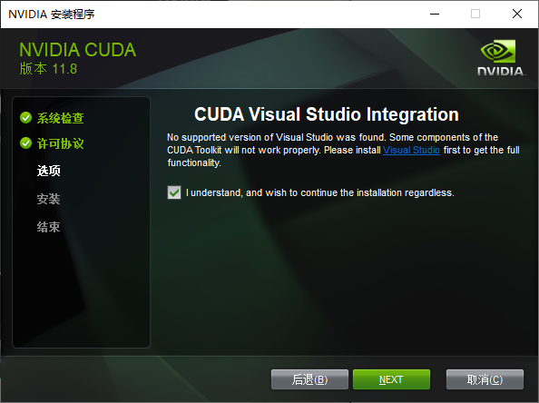
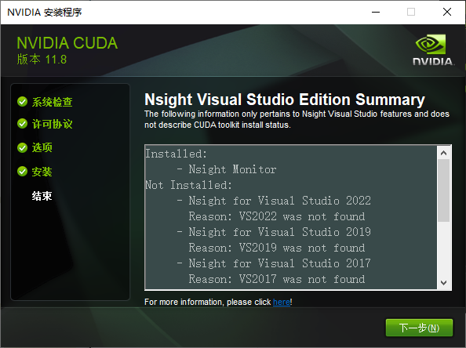

参考文章：

https://zhuanlan.zhihu.com/p/424837529

https://zhuanlan.zhihu.com/p/99880204

https://wiki.sipeed.com/soft/maixpy3/zh/usage/train_AI/ready.html

# 本地训练模型——基于CUDA、PyToch

## 检查自己的显卡是不是英伟达的

## 检查自己的驱动版本

cmd输入

~~~
nvidia-smi
~~~


如图，我的版本是535.98，可以去https://docs.nvidia.com/cuda/cuda-toolkit-release-notes/index.html检查自己的驱动版本可用的CUDA版本。如果驱动版本不够高，可以去https://www.nvidia.cn/Download/index.aspx?lang=cn寻找自己显卡对应的驱动程序。


例如我的驱动版本，可以使用所用的CUDA版本，但是不要下载最新的版本，因为没有对应的Pytoch。可以去https://pytorch.org/get-started/locally/查看支持的CUDA版本。


## 安装CUDA

选择好版本后，就可以安装CUDA了。可以在https://developer.nvidia.com/cuda-toolkit-archive找到所所有的CUDA版本。本地安装和在线安装都可以。这里我选择的是本地安装。


下载完成后，双击exe文件，选择临时解压目录。等到进度条100%后进入安装。


等待一下。



下一步，同意。


选择自定义安装。选择CUDA。


修改安装位置，如果是默认安装，会直接安装到C盘。为了避免BUG，我选择C盘。


同意。



开始安装。


安装完成。



图片中最下三个是显卡驱动，上面的是刚安装的CUDA，如果要删除CUDA，删除上面几个就行。


检查是否安装完成。

输入

```
nvcc -V
```

可以看到，我安装的版本是11.8


进入安装目录，默认位置是`C:\Program Files\NVIDIA GPU Computing Toolkit\CUDA\v11.8`

在里面找到`extras`-->`demo_suite`

在文件资源管理器输入`cmd`，回车


输入

```
deviceQuery.exe
```

输出如下


输入

```
bandwidthTest.exe
```

输出如下


## 安装PyToch

查看python版本、pip版本


官网复制下载链接下载


```
pip3 install torch torchvision torchaudio --index-url https://download.pytorch.org/whl/cu118
```


测试是否安装完成

```
import torch 
x = torch.empty(5, 3) 
print(x) 
```


```
import torch
print(torch.__version__)
print(torch.version.cuda)
```


## windows安装torchsummary、pycocotools

### 安装torchsummary

```
pip3 install torchsummary
```


### 安装pycocotools

首先安装一个Anaconda，具体方法百度

然后在cmd输入

```
conda install -c conda-forge pycocotools
```

等待一下，即可安装成功。

参考至https://zhuanlan.zhihu.com/p/350614391评论区


