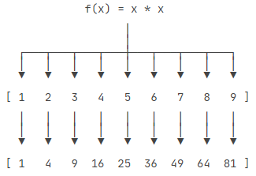

[Python教程 - 廖雪峰的官方网站 (liaoxuefeng.com)](https://www.liaoxuefeng.com/wiki/1016959663602400)

### 函数的参数

在Python中定义函数，可以用必选参数、默认参数、可变参数、关键字参数和命名关键字参数，这5种参数都可以组合使用。但是请注意，参数定义的顺序必须是：必选参数、默认参数、可变参数、命名关键字参数和关键字参数。

- 默认参数一定要用不可变对象，如果是可变对象，程序运行时会有逻辑错误！
- 要注意定义可变参数和关键字参数的语法：
  - `*args`是可变参数，args接收的是一个tuple；
  - `**kw`是关键字参数，kw接收的是一个dict。
- 调用函数时传入可变参数和关键字参数的语法：
  - 可变参数既可以直接传入：`func(1, 2, 3)`，又可以先组装list或tuple，再通过`*args`传入：`func(*(1, 2, 3))`；
  - 关键字参数既可以直接传入：`func(a=1, b=2)`，又可以先组装dict，再通过`**kw`传入：`func(**{'a': 1, 'b': 2})`。
  - 使用`*args`和`**kw`是Python的习惯写法，当然也可以用其他参数名，但最好使用习惯用法。
  - 命名的关键字参数是为了限制调用者可以传入的参数名，同时可以提供默认值。
  - 定义命名的关键字参数在没有可变参数的情况下不要忘了写分隔符`*`，否则定义的将是位置参数。

### 列表生成式

如果要生成`[1x1, 2x2, 3x3, ..., 10x10]`怎么做？方法一是循环：

```python
>>> L = []
>>> for x in range(1, 11):
...    L.append(x * x)
...
>>> L
[1, 4, 9, 16, 25, 36, 49, 64, 81, 100]
```

但是循环太繁琐，而列表生成式则可以用一行语句代替循环生成上面的list：

```python
>>> [x * x for x in range(1, 11)]
[1, 4, 9, 16, 25, 36, 49, 64, 81, 100]
```

for循环后面还可以加上if判断，这样我们就可以筛选出仅偶数的平方：

```python
>>> [x * x for x in range(1, 11) if x % 2 == 0]
[4, 16, 36, 64, 100]
```

还可以使用两层循环，可以生成全排列：

```python
>>> [m + n for m in 'ABC' for n in 'XYZ']
['AX', 'AY', 'AZ', 'BX', 'BY', 'BZ', 'CX', 'CY', 'CZ']
```

使用列表生成式的时候，有些童鞋经常搞不清楚`if...else`的用法。

例如，以下代码正常输出偶数：

```python
>>> [x for x in range(1, 11) if x % 2 == 0]
[2, 4, 6, 8, 10]
```

但是，我们不能在最后的`if`加上`else`：

```python
>>> [x for x in range(1, 11) if x % 2 == 0 else 0]
  File "<stdin>", line 1
    [x for x in range(1, 11) if x % 2 == 0 else 0]
                                              ^
SyntaxError: invalid syntax
```

这是因为跟在`for`后面的`if`是一个筛选条件，不能带`else`，否则如何筛选？

另一些童鞋发现把`if`写在`for`前面必须加`else`，否则报错：

```python
>>> [x if x % 2 == 0 for x in range(1, 11)]
  File "<stdin>", line 1
    [x if x % 2 == 0 for x in range(1, 11)]
                       ^
SyntaxError: invalid syntax
```

这是因为`for`前面的部分是一个表达式，它必须根据`x`计算出一个结果。因此，考察表达式：`x if x % 2 == 0`，它无法根据`x`计算出结果，因为缺少`else`，必须加上`else`：

```python
>>> [x if x % 2 == 0 else -x for x in range(1, 11)]
[-1, 2, -3, 4, -5, 6, -7, 8, -9, 10]
```

上述`for`前面的表达式`x if x % 2 == 0 else -x`才能根据`x`计算出确定的结果。

所以，在一个列表生成式中，`for`前面的`if ... else`是表达式，而`for`后面的`if`是过滤条件，不能带`else`。

### 生成器

通过列表生成式，我们可以直接创建一个列表。但是，受到内存限制，列表容量肯定是有限的。而且，创建一个包含100万个元素的列表，不仅占用很大的存储空间，如果我们仅仅需要访问前面几个元素，那后面绝大多数元素占用的空间都白白浪费了。

所以，如果列表元素可以按照某种算法推算出来，那我们是否可以在循环的过程中不断推算出后续的元素呢？这样就不必创建完整的list，从而节省大量的空间。在Python中，这种一边循环一边计算的机制，称为生成器：generator。

要创建一个generator，有很多种方法。第一种方法很简单，只要把一个列表生成式的`[]`改成`()`，就创建了一个generator：

```python
>>> L = [x * x for x in range(10)]
>>> L
[0, 1, 4, 9, 16, 25, 36, 49, 64, 81]
>>> g = (x * x for x in range(10))
>>> g
<generator object <genexpr> at 0x1022ef630>
```

创建`L`和`g`的区别仅在于最外层的`[]`和`()`，`L`是一个list，而`g`是一个generator。

我们可以直接打印出list的每一个元素，但我们怎么打印出generator的每一个元素呢？

如果要一个一个打印出来，可以通过`next()`函数获得generator的下一个返回值：

```python
>>> next(g)
0
>>> next(g)
1
>>> next(g)
4
>>> next(g)
9
>>> next(g)
16
>>> next(g)
25
>>> next(g)
36
>>> next(g)
49
>>> next(g)
64
>>> next(g)
81
>>> next(g)
Traceback (most recent call last):
  File "<stdin>", line 1, in <module>
StopIteration
```

我们讲过，generator保存的是算法，每次调用`next(g)`，就计算出`g`的下一个元素的值，直到计算到最后一个元素，没有更多的元素时，抛出`StopIteration`的错误。

当然，上面这种不断调用`next(g)`实在是太变态了，正确的方法是使用`for`循环，因为generator也是可迭代对象：

```python
>>> g = (x * x for x in range(10))
>>> for n in g:
...     print(n)
... 
0
1
4
9
16
25
36
49
64
81
```

所以，我们创建了一个generator后，基本上永远不会调用`next()`，而是通过`for`循环来迭代它，并且不需要关心`StopIteration`的错误。

### 迭代器

可以被`next()`函数调用并不断返回下一个值的对象称为迭代器：`Iterator`。

可以使用`isinstance()`判断一个对象是否是`Iterator`对象：

```python
>>> from collections.abc import Iterator
>>> isinstance((x for x in range(10)), Iterator)
True
>>> isinstance([], Iterator)
False
>>> isinstance({}, Iterator)
False
>>> isinstance('abc', Iterator)
False
```

生成器都是`Iterator`对象，但`list`、`dict`、`str`虽然是`Iterable`，却不是`Iterator`。

把`list`、`dict`、`str`等`Iterable`变成`Iterator`可以使用`iter()`函数：

```python
>>> isinstance(iter([]), Iterator)
True
>>> isinstance(iter('abc'), Iterator)
True
```

为什么`list`、`dict`、`str`等数据类型不是`Iterator`？

这是因为Python的`Iterator`对象表示的是一个数据流，Iterator对象可以被`next()`函数调用并不断返回下一个数据，直到没有数据时抛出`StopIteration`错误。可以把这个数据流看做是一个有序序列，但我们却不能提前知道序列的长度，只能不断通过`next()`函数实现按需计算下一个数据，所以`Iterator`的计算是惰性的，只有在需要返回下一个数据时它才会计算。

`Iterator`甚至可以表示一个无限大的数据流，例如全体自然数。而使用list是永远不可能存储全体自然数的。


## 函数式编程

### 高阶函数

#### 变量可以指向函数

以Python内置的求绝对值的函数`abs()`为例，调用该函数用以下代码：

```python
>>> abs(-10)
10
```

但是，如果只写`abs`呢？

```python
>>> abs
<built-in function abs>
```

可见，`abs(-10)`是函数调用，而`abs`是函数本身。

要获得函数调用结果，我们可以把结果赋值给变量：

```python
>>> x = abs(-10)
>>> x
10
```

但是，如果把函数本身赋值给变量呢？

```python
>>> f = abs
>>> f
<built-in function abs>
```

结论：函数本身也可以赋值给变量，即：变量可以指向函数。

如果一个变量指向了一个函数，那么，可否通过该变量来调用这个函数？用代码验证一下：

```python
>>> f = abs
>>> f(-10)
10
```

成功！说明变量`f`现在已经指向了`abs`函数本身。直接调用`abs()`函数和调用变量`f()`完全相同。

#### 函数名也是变量

那么函数名是什么呢？函数名其实就是指向函数的变量！对于`abs()`这个函数，完全可以把函数名`abs`看成变量，它指向一个可以计算绝对值的函数！

如果把`abs`指向其他对象，会有什么情况发生？

```python
>>> abs = 10
>>> abs(-10)
Traceback (most recent call last):
  File "<stdin>", line 1, in <module>
TypeError: 'int' object is not callable
```

把`abs`指向`10`后，就无法通过`abs(-10)`调用该函数了！因为`abs`这个变量已经不指向求绝对值函数而是指向一个整数`10`！

当然实际代码绝对不能这么写，这里是为了说明函数名也是变量。要恢复`abs`函数，请重启Python交互环境。

注：由于`abs`函数实际上是定义在`import builtins`模块中的，所以要让修改`abs`变量的指向在其它模块也生效，要用`import builtins; builtins.abs = 10`。

#### 传入函数

既然变量可以指向函数，函数的参数能接收变量，那么一个函数就可以接收另一个函数作为参数，这种函数就称之为高阶函数。

一个最简单的高阶函数：

```python
def add(x, y, f):
    return f(x) + f(y)
```

当我们调用`add(-5, 6, abs)`时，参数`x`，`y`和`f`分别接收`-5`，`6`和`abs`，根据函数定义，我们可以推导计算过程为：

```python
x = -5
y = 6
f = abs
f(x) + f(y) ==> abs(-5) + abs(6) ==> 11
return 11
```

### map/reduce

Python内建了`map()`和`reduce()`函数。

如果你读过Google的那篇大名鼎鼎的论文“[MapReduce: Simplified Data Processing on Large Clusters](http://research.google.com/archive/mapreduce.html)”，你就能大概明白map/reduce的概念。

#### map

我们先看map。`map()`函数接收两个参数，一个是函数，一个是`Iterable`，`map`将传入的函数依次作用到序列的每个元素，并把结果作为新的`Iterator`返回。

举例说明，比如我们有一个函数f(x)=x2，要把这个函数作用在一个list `[1, 2, 3, 4, 5, 6, 7, 8, 9]`上，就可以用`map()`实现如下：



现在，我们用Python代码实现：

```python
>>> def f(x):
...     return x * x
...
>>> r = map(f, [1, 2, 3, 4, 5, 6, 7, 8, 9])
>>> list(r)
[1, 4, 9, 16, 25, 36, 49, 64, 81]
```

`map()`传入的第一个参数是`f`，即函数对象本身。由于结果`r`是一个`Iterator`，`Iterator`是惰性序列，因此通过`list()`函数让它把整个序列都计算出来并返回一个list。

所以，`map()`作为高阶函数，事实上它把运算规则抽象了，因此，我们不但可以计算简单的f(x)=x2，还可以计算任意复杂的函数，比如，把这个list所有数字转为字符串：

```python
>>> list(map(str, [1, 2, 3, 4, 5, 6, 7, 8, 9]))
['1', '2', '3', '4', '5', '6', '7', '8', '9']
```

#### redece

再看`reduce`的用法。`reduce`把一个函数作用在一个序列`[x1, x2, x3, ...]`上，这个函数必须接收两个参数，`reduce`把结果继续和序列的下一个元素做累积计算，其效果就是：

```
reduce(f, [x1, x2, x3, x4]) = f(f(f(x1, x2), x3), x4)
```

如果要把序列`[1, 3, 5, 7, 9]`变换成整数`13579`，`reduce`就可以派上用场：

```python
>>> from functools import reduce
>>> def fn(x, y):
...     return x * 10 + y
...
>>> reduce(fn, [1, 3, 5, 7, 9])
13579
```

对上面的例子稍加改动，配合`map()`，我们就可以写出把`str`转换为`int`的函数：

```python
>>> from functools import reduce
>>> def fn(x, y):
...     return x * 10 + y
...
>>> def char2num(s):
...     digits = {'0': 0, '1': 1, '2': 2, '3': 3, '4': 4, '5': 5, '6': 6, '7': 7, '8': 8, '9': 9}
...     return digits[s]
...
>>> reduce(fn, map(char2num, '13579'))
13579
```

整理成一个`str2int`的函数就是：

```python
from functools import reduce

DIGITS = {'0': 0, '1': 1, '2': 2, '3': 3, '4': 4, '5': 5, '6': 6, '7': 7, '8': 8, '9': 9}

def str2int(s):
    def fn(x, y):
        return x * 10 + y
    def char2num(s):
        return DIGITS[s]
    return reduce(fn, map(char2num, s))
```

还可以用lambda函数进一步简化成：

```python
from functools import reduce

DIGITS = {'0': 0, '1': 1, '2': 2, '3': 3, '4': 4, '5': 5, '6': 6, '7': 7, '8': 8, '9': 9}

def char2num(s):
    return DIGITS[s]

def str2int(s):
    return reduce(lambda x, y: x * 10 + y, map(char2num, s))
```

也就是说，假设Python没有提供`int()`函数，你完全可以自己写一个把字符串转化为整数的函数，而且只需要几行代码！

### filter

Python内建的`filter()`函数用于过滤序列。

和`map()`类似，`filter()`也接收一个函数和一个序列。和`map()`不同的是，`filter()`把传入的函数依次作用于每个元素，然后根据返回值是`True`还是`False`决定保留还是丢弃该元素。

例如，在一个list中，删掉偶数，只保留奇数，可以这么写：

```python
def is_odd(n):
    return n % 2 == 1

list(filter(is_odd, [1, 2, 4, 5, 6, 9, 10, 15]))
# 结果: [1, 5, 9, 15]
```

把一个序列中的空字符串删掉，可以这么写：

```python
def not_empty(s):
    return s and s.strip()

list(filter(not_empty, ['A', '', 'B', None, 'C', '  ']))
# 结果: ['A', 'B', 'C']
```

可见用`filter()`这个高阶函数，关键在于正确实现一个“筛选”函数。

注意到`filter()`函数返回的是一个`Iterator`，也就是一个惰性序列，所以要强迫`filter()`完成计算结果，需要用`list()`函数获得所有结果并返回list。

#### 用filter求素数

计算[素数](http://baike.baidu.com/view/10626.htm)的一个方法是[埃氏筛法](http://baike.baidu.com/view/3784258.htm)，它的算法理解起来非常简单：

首先，列出从`2`开始的所有自然数，构造一个序列：

2, 3, 4, 5, 6, 7, 8, 9, 10, 11, 12, 13, 14, 15, 16, 17, 18, 19, 20, ...

取序列的第一个数`2`，它一定是素数，然后用`2`把序列的`2`的倍数筛掉：

3, ~~4~~, 5, ~~6~~, 7, ~~8~~, 9, ~~10~~, 11, ~~12~~, 13, ~~14~~, 15, ~~16~~, 17, ~~18~~, 19, ~~20~~, ...

取新序列的第一个数`3`，它一定是素数，然后用`3`把序列的`3`的倍数筛掉：

5, ~~6~~, 7, ~~8~~, ~~9~~, ~~10~~, 11, ~~12~~, 13, ~~14~~, ~~15~~, ~~16~~, 17, ~~18~~, 19, ~~20~~, ...

取新序列的第一个数`5`，然后用`5`把序列的`5`的倍数筛掉：

7, ~~8~~, ~~9~~, ~~10~~, 11, ~~12~~, 13, ~~14~~, ~~15~~, ~~16~~, 17, ~~18~~, 19, ~~20~~, ...

不断筛下去，就可以得到所有的素数。

用Python来实现这个算法，可以先构造一个从`3`开始的奇数序列：

```python
def _odd_iter():
    n = 1
    while True:
        n = n + 2
        yield n
```

注意这是一个生成器，并且是一个无限序列。

然后定义一个筛选函数：

```python
def _not_divisible(n):
    return lambda x: x % n > 0
```

最后，定义一个生成器，不断返回下一个素数：

```python
def primes():
    yield 2
    it = _odd_iter() # 初始序列
    while True:
        n = next(it) # 返回序列的第一个数
        yield n
        it = filter(_not_divisible(n), it) # 构造新序列
```

这个生成器先返回第一个素数`2`，然后，利用`filter()`不断产生筛选后的新的序列。

由于`primes()`也是一个无限序列，所以调用时需要设置一个退出循环的条件：

```python
# 打印1000以内的素数:
for n in primes():
    if n < 1000:
        print(n)
    else:
        break
```

注意到`Iterator`是惰性计算的序列，所以我们可以用Python表示“全体自然数”，“全体素数”这样的序列，而代码非常简洁。

### sorted

#### 排序算法

排序也是在程序中经常用到的算法。无论使用冒泡排序还是快速排序，排序的核心是比较两个元素的大小。如果是数字，我们可以直接比较，但如果是字符串或者两个dict呢？直接比较数学上的大小是没有意义的，因此，比较的过程必须通过函数抽象出来。

Python内置的`sorted()`函数就可以对list进行排序：

```python
>>> sorted([36, 5, -12, 9, -21])
[-21, -12, 5, 9, 36]
```

此外，`sorted()`函数也是一个高阶函数，它还可以接收一个`key`函数来实现自定义的排序，例如按绝对值大小排序：

```python
>>> sorted([36, 5, -12, 9, -21], key=abs)
[5, 9, -12, -21, 36]
```

key指定的函数将作用于list的每一个元素上，并根据key函数返回的结果进行排序。对比原始的list和经过`key=abs`处理过的list：

```python
list = [36, 5, -12, 9, -21]

keys = [36, 5,  12, 9,  21]
```

### 返回函数

#### 函数作为返回值

高阶函数除了可以接受函数作为参数外，还可以把函数作为结果值返回。

我们来实现一个可变参数的求和。通常情况下，求和的函数是这样定义的：

```python
def calc_sum(*args):
    ax = 0
    for n in args:
        ax = ax + n
    return ax
```

但是，如果不需要立刻求和，而是在后面的代码中，根据需要再计算怎么办？可以不返回求和的结果，而是返回求和的函数：

```python
def lazy_sum(*args):
    def sum():
        ax = 0
        for n in args:
            ax = ax + n
        return ax
    return sum
```

当我们调用`lazy_sum()`时，返回的并不是求和结果，而是求和函数：

```python
>>> f = lazy_sum(1, 3, 5, 7, 9)
>>> f
<function lazy_sum.<locals>.sum at 0x101c6ed90>
```

调用函数`f`时，才真正计算求和的结果：

```python
>>> f()
25
```

在这个例子中，我们在函数`lazy_sum`中又定义了函数`sum`，并且，内部函数`sum`可以引用外部函数`lazy_sum`的参数和局部变量，当`lazy_sum`返回函数`sum`时，相关参数和变量都保存在返回的函数中，这种称为“闭包（Closure）”的程序结构拥有极大的威力。

请再注意一点，当我们调用`lazy_sum()`时，每次调用都会返回一个新的函数，即使传入相同的参数：

```python
>>> f1 = lazy_sum(1, 3, 5, 7, 9)
>>> f2 = lazy_sum(1, 3, 5, 7, 9)
>>> f1==f2
False
```

`f1()`和`f2()`的调用结果互不影响。

#### 闭包

```python
def count():
    fs = []
    for i in range(1, 4):
        def f():
             return i*i
        fs.append(f)
    return fs

f1, f2, f3 = count()
```

在上面的例子中，每次循环，都创建了一个新的函数，然后，把创建的3个函数都返回了。

你可能认为调用`f1()`，`f2()`和`f3()`结果应该是`1`，`4`，`9`，但实际结果是：

```python
>>> f1()
9
>>> f2()
9
>>> f3()
9
```

全部都是`9`！原因就在于返回的函数引用了变量`i`，但它并非立刻执行。等到3个函数都返回时，它们所引用的变量`i`已经变成了`3`，因此最终结果为`9`。

如果一定要引用循环变量怎么办？方法是再创建一个函数，用该函数的参数绑定循环变量当前的值，无论该循环变量后续如何更改，已绑定到函数参数的值不变：

```python
def count():
    def f(j):
        def g():
            return j*j
        return g
    fs = []
    for i in range(1, 4):
        fs.append(f(i)) # f(i)立刻被执行，因此i的当前值被传入f()
    return fs
```

再看看结果：

```python
>>> f1, f2, f3 = count()
>>> f1()
1
>>> f2()
4
>>> f3()
9
```

#### nonlocal

使用闭包，就是内层函数引用了外层函数的局部变量。如果只是读外层变量的值，我们会发现返回的闭包函数调用一切正常：

```python
def inc():
    x = 0
    def fn():
        # 仅读取x的值:
        return x + 1
    return fn

f = inc()
print(f()) # 1
print(f()) # 1
```

但是，如果对外层变量赋值，由于Python解释器会把`x`当作函数`fn()`的局部变量，它会报错。

原因是`x`作为局部变量并没有初始化，直接计算`x+1`是不行的。但我们其实是想引用`inc()`函数内部的`x`，所以需要在`fn()`函数内部加一个`nonlocal x`的声明。加上这个声明后，解释器把`fn()`的`x`看作外层函数的局部变量，它已经被初始化了，可以正确计算`x+1`。

### 匿名函数

在Python中，对匿名函数提供了有限支持。还是以`map()`函数为例，计算f(x)=x2时，除了定义一个`f(x)`的函数外，还可以直接传入匿名函数：

```python
>>> list(map(lambda x: x * x, [1, 2, 3, 4, 5, 6, 7, 8, 9]))
[1, 4, 9, 16, 25, 36, 49, 64, 81]
```

通过对比可以看出，匿名函数`lambda x: x * x`实际上就是：

```python
def f(x):
    return x * x
```

关键字`lambda`表示匿名函数，冒号前面的`x`表示函数参数。

匿名函数有个限制，就是只能有一个表达式，不用写`return`，返回值就是该表达式的结果。

用匿名函数有个好处，因为函数没有名字，不必担心函数名冲突。此外，匿名函数也是一个函数对象，也可以把匿名函数赋值给一个变量，再利用变量来调用该函数。

同样，也可以把匿名函数作为返回值返回。

### 装饰器

由于函数也是一个对象，而且函数对象可以被赋值给变量，所以，通过变量也能调用该函数。

```python
>>> def now():
...     print('2015-3-25')
...
>>> f = now
>>> f()
2015-3-25
```

函数对象有一个`__name__`属性（注意：是前后各两个下划线），可以拿到函数的名字：

```python
>>> now.__name__
'now'
>>> f.__name__
'now'
```

现在，假设我们要增强`now()`函数的功能，比如，在函数调用前后自动打印日志，但又不希望修改`now()`函数的定义，这种在代码运行期间动态增加功能的方式，称之为“装饰器”（Decorator）。

本质上，decorator就是一个返回函数的高阶函数。所以，我们要定义一个能打印日志的decorator，可以定义如下：

```python
def log(func):
    def wrapper(*args, **kw):
        print('call %s():' % func.__name__)
        return func(*args, **kw)
    return wrapper
```

观察上面的`log`，因为它是一个decorator，所以接受一个函数作为参数，并返回一个函数。我们要借助Python的@语法，把decorator置于函数的定义处：

```python
@log
def now():
    print('2015-3-25')
```

调用`now()`函数，不仅会运行`now()`函数本身，还会在运行`now()`函数前打印一行日志：

```python
>>> now()
call now():
2015-3-25
```

把`@log`放到`now()`函数的定义处，相当于执行了语句：

```python
now = log(now)
```

由于`log()`是一个decorator，返回一个函数，所以，原来的`now()`函数仍然存在，只是现在同名的`now`变量指向了新的函数，于是调用`now()`将执行新函数，即在`log()`函数中返回的`wrapper()`函数。

`wrapper()`函数的参数定义是`(*args, **kw)`，因此，`wrapper()`函数可以接受任意参数的调用。在`wrapper()`函数内，首先打印日志，再紧接着调用原始函数。

如果decorator本身需要传入参数，那就需要编写一个返回decorator的高阶函数，写出来会更复杂。比如，要自定义log的文本：

```python
def log(text):
    def decorator(func):
        def wrapper(*args, **kw):
            print('%s %s():' % (text, func.__name__))
            return func(*args, **kw)
        return wrapper
    return decorator
```

这个3层嵌套的decorator用法如下：

```python
@log('execute')
def now():
    print('2015-3-25')
```

执行结果如下：

```python
>>> now()
execute now():
2015-3-25
```

和两层嵌套的decorator相比，3层嵌套的效果是这样的：

```python
>>> now = log('execute')(now)
```

我们来剖析上面的语句，首先执行`log('execute')`，返回的是`decorator`函数，再调用返回的函数，参数是`now`函数，返回值最终是`wrapper`函数。

以上两种decorator的定义都没有问题，但还差最后一步。因为我们讲了函数也是对象，它有`__name__`等属性，但你去看经过decorator装饰之后的函数，它们的`__name__`已经从原来的`'now'`变成了`'wrapper'`：

```python
>>> now.__name__
'wrapper'
```

因为返回的那个`wrapper()`函数名字就是`'wrapper'`，所以，需要把原始函数的`__name__`等属性复制到`wrapper()`函数中，否则，有些依赖函数签名的代码执行就会出错。

不需要编写`wrapper.__name__ = func.__name__`这样的代码，Python内置的`functools.wraps`就是干这个事的，所以，一个完整的decorator的写法如下：

```python
import functools

def log(func):
    @functools.wraps(func)
    def wrapper(*args, **kw):
        print('call %s():' % func.__name__)
        return func(*args, **kw)
    return wrapper
```

### 偏函数

在介绍函数参数的时候，我们讲到，通过设定参数的默认值，可以降低函数调用的难度。而偏函数也可以做到这一点。举例如下：

`int()`函数可以把字符串转换为整数，当仅传入字符串时，`int()`函数默认按十进制转换：

```python
>>> int('12345')
12345
```

但`int()`函数还提供额外的`base`参数，默认值为`10`。如果传入`base`参数，就可以做N进制的转换：

```python
>>> int('12345', base=8)
5349
>>> int('12345', 16)
74565
```

假设要转换大量的二进制字符串，每次都传入`int(x, base=2)`非常麻烦，于是，我们想到，可以定义一个`int2()`的函数，默认把`base=2`传进去：

```python
def int2(x, base=2):
    return int(x, base)
```

这样，我们转换二进制就非常方便了：

```python
>>> int2('1000000')
64
>>> int2('1010101')
85
```

`functools.partial`就是帮助我们创建一个偏函数的，不需要我们自己定义`int2()`，可以直接使用下面的代码创建一个新的函数`int2`：

```python
>>> import functools
>>> int2 = functools.partial(int, base=2)
>>> int2('1000000')
64
>>> int2('1010101')
85
```

所以，简单总结`functools.partial`的作用就是，把一个函数的某些参数给固定住（也就是设置默认值），返回一个新的函数，调用这个新函数会更简单。

最后，创建偏函数时，实际上可以接收函数对象、`*args`和`**kw`这3个参数，当传入：

```python
int2 = functools.partial(int, base=2)
```

实际上固定了int()函数的关键字参数`base`，也就是：

```python
int2('10010')
```

相当于：

```python
kw = { 'base': 2 }
int('10010', **kw)
```

## 模块

在计算机程序的开发过程中，随着程序代码越写越多，在一个文件里代码就会越来越长，越来越不容易维护。

为了编写可维护的代码，我们把很多函数分组，分别放到不同的文件里，这样，每个文件包含的代码就相对较少，很多编程语言都采用这种组织代码的方式。在Python中，一个.py文件就称之为一个模块（Module）。

使用模块有什么好处？

最大的好处是大大提高了代码的可维护性。其次，编写代码不必从零开始。当一个模块编写完毕，就可以被其他地方引用。我们在编写程序的时候，也经常引用其他模块，包括Python内置的模块和来自第三方的模块。

使用模块还可以避免函数名和变量名冲突。相同名字的函数和变量完全可以分别存在不同的模块中，因此，我们自己在编写模块时，不必考虑名字会与其他模块冲突。但是也要注意，尽量不要与内置函数名字冲突。点[这里](http://docs.python.org/3/library/functions.html)查看Python的所有内置函数。

你也许还想到，如果不同的人编写的模块名相同怎么办？为了避免模块名冲突，Python又引入了按目录来组织模块的方法，称为包（Package）。

举个例子，一个`abc.py`的文件就是一个名字叫`abc`的模块，一个`xyz.py`的文件就是一个名字叫`xyz`的模块。

现在，假设我们的`abc`和`xyz`这两个模块名字与其他模块冲突了，于是我们可以通过包来组织模块，避免冲突。方法是选择一个顶层包名，比如`mycompany`，按照如下目录存放：

```ascii
mycompany
├─ __init__.py
├─ abc.py
└─ xyz.py
```

引入了包以后，只要顶层的包名不与别人冲突，那所有模块都不会与别人冲突。现在，`abc.py`模块的名字就变成了`mycompany.abc`，类似的，`xyz.py`的模块名变成了`mycompany.xyz`。

请注意，每一个包目录下面都会有一个`__init__.py`的文件，这个文件是必须存在的，否则，Python就把这个目录当成普通目录，而不是一个包。`__init__.py`可以是空文件，也可以有Python代码，因为`__init__.py`本身就是一个模块，而它的模块名就是`mycompany`。

类似的，可以有多级目录，组成多级层次的包结构。比如如下的目录结构：

```ascii
mycompany
 ├─ web
 │  ├─ __init__.py
 │  ├─ utils.py
 │  └─ www.py
 ├─ __init__.py
 ├─ abc.py
 └─ utils.py
```

文件`www.py`的模块名就是`mycompany.web.www`，两个文件`utils.py`的模块名分别是`mycompany.utils`和`mycompany.web.utils`。

 自己创建模块时要注意命名，不能和Python自带的模块名称冲突。例如，系统自带了sys模块，自己的模块就不可命名为sys.py，否则将无法导入系统自带的sys模块。

### 使用模块

Python本身就内置了很多非常有用的模块，只要安装完毕，这些模块就可以立刻使用。

我们以内建的`sys`模块为例，编写一个`hello`的模块：

```python
#!/usr/bin/env python3
# -*- coding: utf-8 -*-

' a test module '

__author__ = 'Michael Liao'

import sys

def test():
    args = sys.argv
    if len(args)==1:
        print('Hello, world!')
    elif len(args)==2:
        print('Hello, %s!' % args[1])
    else:
        print('Too many arguments!')

if __name__=='__main__':
    test()
```

第1行和第2行是标准注释，第1行注释可以让这个`hello.py`文件直接在Unix/Linux/Mac上运行，第2行注释表示.py文件本身使用标准UTF-8编码；

第4行是一个字符串，表示模块的文档注释，任何模块代码的第一个字符串都被视为模块的文档注释；

第6行使用`__author__`变量把作者写进去，这样当你公开源代码后别人就可以瞻仰你的大名；

以上就是Python模块的标准文件模板，当然也可以全部删掉不写，但是，按标准办事肯定没错。

使用`sys`模块的第一步，就是导入该模块：

```python
import sys
```

导入`sys`模块后，我们就有了变量`sys`指向该模块，利用`sys`这个变量，就可以访问`sys`模块的所有功能。

`sys`模块有一个`argv`变量，用list存储了命令行的所有参数。`argv`至少有一个元素，因为第一个参数永远是该.py文件的名称，例如：

运行`python3 hello.py`获得的`sys.argv`就是`['hello.py']`；

运行`python3 hello.py Michael`获得的`sys.argv`就是`['hello.py', 'Michael']`。

最后，注意到这两行代码：

```python
if __name__=='__main__':
    test()
```

当我们在命令行运行`hello`模块文件时，Python解释器把一个特殊变量`__name__`置为`__main__`，而如果在其他地方导入该`hello`模块时，`if`判断将失败，因此，这种`if`测试可以让一个模块通过命令行运行时执行一些额外的代码，最常见的就是运行测试。

### 作用域

在一个模块中，我们可能会定义很多函数和变量，但有的函数和变量我们希望给别人使用，有的函数和变量我们希望仅仅在模块内部使用。在Python中，是通过`_`前缀来实现的。

正常的函数和变量名是公开的（public），可以被直接引用，比如：`abc`，`x123`，`PI`等；

类似`__xxx__`这样的变量是特殊变量，可以被直接引用，但是有特殊用途，比如上面的`__author__`，`__name__`就是特殊变量，`hello`模块定义的文档注释也可以用特殊变量`__doc__`访问，我们自己的变量一般不要用这种变量名；

类似`_xxx`和`__xxx`这样的函数或变量就是非公开的（private），不应该被直接引用，比如`_abc`，`__abc`等；

之所以我们说，private函数和变量“不应该”被直接引用，而不是“不能”被直接引用，是因为Python并没有一种方法可以完全限制访问private函数或变量，但是，从编程习惯上不应该引用private函数或变量。

private函数或变量不应该被别人引用，那它们有什么用呢？请看例子：

```python
def _private_1(name):
    return 'Hello, %s' % name

def _private_2(name):
    return 'Hi, %s' % name

def greeting(name):
    if len(name) > 3:
        return _private_1(name)
    else:
        return _private_2(name)
```

我们在模块里公开`greeting()`函数，而把内部逻辑用private函数隐藏起来了，这样，调用`greeting()`函数不用关心内部的private函数细节，这也是一种非常有用的代码封装和抽象的方法，即：

外部不需要引用的函数全部定义成private，只有外部需要引用的函数才定义为public。

### 常用第三方模块

- Pillow

  - PIL：Python Imaging Library，已经是Python平台事实上的图像处理标准库了。PIL功能非常强大，但API却非常简单易用。

  - 由于PIL仅支持到Python 2.7，加上年久失修，于是一群志愿者在PIL的基础上创建了兼容的版本，名字叫[Pillow](https://github.com/python-pillow/Pillow)，支持最新Python 3.x，又加入了许多新特性，因此，我们可以直接安装使用Pillow。

  - 要详细了解PIL的强大功能，请请参考Pillow官方文档：[Pillow官方文档](https://pillow.readthedocs.org/)

- requests

  - Python内置的urllib模块，用于访问网络资源。但是，它用起来比较麻烦，而且，缺少很多实用的高级功能。
  - 更好的方案是使用requests。它是一个Python第三方库，处理URL资源特别方便。

- chardet

  - 字符串编码一直是令人非常头疼的问题，尤其是我们在处理一些不规范的第三方网页的时候。虽然Python提供了Unicode表示的`str`和`bytes`两种数据类型，并且可以通过`encode()`和`decode()`方法转换，但是，在不知道编码的情况下，对`bytes`做`decode()`不好做。

  - 对于未知编码的`bytes`，要把它转换成`str`，需要先“猜测”编码。猜测的方式是先收集各种编码的特征字符，根据特征字符判断，就能有很大概率“猜对”。

  - 当然，我们肯定不能从头自己写这个检测编码的功能，这样做费时费力。chardet这个第三方库正好就派上了用场。用它来检测编码，简单易用。

- psutil
  - 在Python中获取系统信息的另一个好办法是使用`psutil`这个第三方模块。顾名思义，psutil = process and system utilities，它不仅可以通过一两行代码实现系统监控，还可以跨平台使用，支持Linux／UNIX／OSX／Windows等，是系统管理员和运维小伙伴不可或缺的必备模块。
- venv
  - venv为应用提供了隔离的Python运行环境，解决了不同应用间多版本的冲突问题。

## 使用MicroPython

[MicroPython](https://micropython.org/)是Python的一个精简版本，它是为了运行在单片机这样的性能有限的微控制器上，最小体积仅256K，运行时仅需16K内存。

MicroPython是基于Python 3.4的语法标准。因为要适应嵌入式微控制器，所以裁剪了大部分标准库，仅保留部分模块如`math`、`sys`的部分函数和类。此外，很多标准模块如`json`、`re`等在MicroPython中变成了以`u`开头的`ujson`、`ure`，表示针对MicroPython开发的标准库。

目前，MicroPython除了可以运行在最初开发的[pyboard](https://store.micropython.org/pyb-features)微控制器上外，还可以运行在大量基于ARM的嵌入式系统，如[Arduino](https://www.arduino.cc/)，这样我们就可以通过Python来非常方便地开发自动控制、机器人这样的应用。


