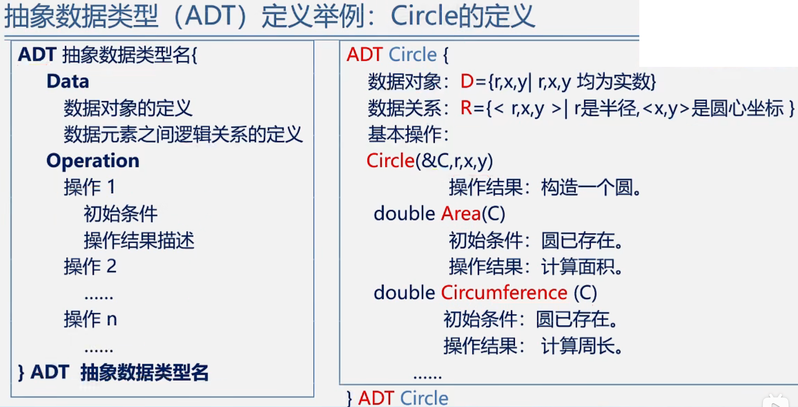

# 基本概念和术语

## （一） 数据、数据元素和数据项 、数据对象

### 1.数据

- 是能输入计算机且能被计算机处理的**各种符号的集合**
  - 信息的载体
  - 是对客观事物符号化的表示
  - 能够被计算机识别、存储和加工

- 包括：
  - 数值型的数据：整数、实数等
  - 非数值类型：文字、图像、图形、声音等

### 2.数据元素和数据项

- 数据元素
  - 是数据的**基本单位**，在计算机程序中通常作为一个整体进行考虑和处理
  - 也简称**元素**，或称为记录，结点或顶点
  - 一个数据元素可以由若干个数据项组成
- 数据项
  - 构成数据元素的**最小单位**
- 数据、数据元素、数据项三者之间的关系
  - 数据 > 数据元素 > 数据项
  - 例：学生表 > 个人记录 > 学号、姓名……

### 3.数据对象

- 是**性质相同的数据元素**的集合，是一个数据的子集

- 数据元素与数据对象

  - 数据元素——组成数据的基本单位

    与数据的关系：是集合的个体

  - 数据对象——性质相同的数据元素的集合

    与数据元素的关系是：集合的子集

## （二）数据结构

### 1.数据结构的内容

- 数据结构
  - 数据元素不是孤立存在的，它们之间存在某种关系，**数据元素相互之间的关系称为**==结构==
  - 是指**相互之间存在的一种或多种特定关系**的数据元素的集合
  - 或者说，数据结构是**带结构的**数据元素的集合
- ==数据结构包括以下三个方面的内容==：
  - 数据元素之间的逻辑关系，也称为**逻辑结构**
  - 数据元素及其关系在计算机内存中的表示（又称映象），称为数据的**物理结构**或数据的**存储结构**
  - 数据的**运算和实现**，即对数据元素可以施加的操作以及这些操作在相应的存储结构上的实现

### 2.数据结构的两个层次

- 逻辑结构
  - 描述数据元素之间的逻辑关系
  - 与数据存储无关，独立于计算机
  - 是从具体问题抽象出来数学模型
- 物理结构
  - 数据元素及其关系在计算机存储器中的结构（存储方式）
  - 是数据结构在计算机中的表示
- **逻辑结构和存储结构的关系**
  - 存储结构是逻辑关系的映象与元素本身的映象
  - 逻辑结构是数据结构的抽象，存储结构是数据结构的实现
  - 两者综合起来建立了数据元素之间的结构关系

### 3.逻辑结构的种类

- 划分方法一
  - **线性结构**：
    有且只有一个开始和终端结点，并且所有结点都最多只有一个前驱和一个直接后继
    例如：线性表，栈，队列，串
  - **非线性结构**：
    一个结点可能有多个直接前驱和直接后继
    例如：树，图
- 划分方法二——四种基本逻辑
  - **集合结构**：结构中的数据元素之间除了==同属于一个集合==的关系外，无其他任何关系。
  - **线性结构**：结构中的数据元素之间存在着==一对一==的线性关系
  - **树形结构**：结构中的数据结构元素之间存在着==一对多==的层次关系
  - **图形结构**或==网状结构==：结构中的数据结构元素之间存在==多对多==的任意关系

### 4.存储结构的种类——四种基本的存储结构

- **顺序存储结构**：
  - 用一组==连续==的存储单元==依次==存储数据元素，数据元素之间的逻辑关系由元素的==存储位置==来表示
  - C语言中用数组来实现顺序存储结构

- **链式存储结构**：
  - 用一组==任意==的存储单元存储数据元素，数据元素之间的逻辑关系用==指针==来表示
  - C语言中用指针来实现链式存储结构

- 索引存储结构（仅做了解）：
  - 在存储结点信息时，还建立附加的==索引表==，即建立一个目录

- 散列存储结构（仅做了解）：
  - 根据结点的关键字直接计算出该结点的存储地址

### 5.数据类型

- 在使用高级程序设计语言编写程序时，必须对程序中出现的每个变量、常亮或表达式，明确说明它们所属的**数据类型**

  - 例如：C语言中：
    - 提供int，char，float，double，等基本数据类型
    - 数组、结构、共用体、枚举等基本构造类型
    - 还有指针、空类型
    - 用户也可以用typedef自己定义数据类型

- 一些最基本的数据结构可以用数据类型来实现，如数组、字符串等

- 而另一些常用的数据结构，如栈、队列、树、图等，不能直接用数据类型来表示

- 高级语言中的数据类型明显地或隐含地规定了在程序执行期间变量和表达的所有可能的取值范围，以及在这些数值范围上所允许进行的操作

  - 例如，C语言定义变量为int类型，就表示i是[-min,max]范围的整数，在这个整数集上可以进行+、-、*、\、%等操作

- 数据类型的作用：

  约束变量或常量的**取值范围**

  约束变量或常量的**操作**

- 数据类型：==数据类型==是一组性质相同的**值的集合**以及定义于这个值集合上的**一组操作**的总称
  ==数据类型 = 值的集合 + 值集合上的一组操作==

### 6.抽象数据类型（ADT）

- 抽象数据类型：**是指一个数学模型以及定义在此数学模型上的一组操作**

  - 由用户定义，从问题抽象出==数据模型==（逻辑结构）
  - 还包括定义在数据模型上的一组==抽象运算==（相关操作）
  - 不考虑计算机内的具体存储结构与运算的具体实现算法

- 抽象数据类型的形式定义
  抽象数据类型可用**（D，S，P）**==三元组==表示
  其中：
  **D**是数据对象
  **S**是D上的关系集
  **P**是对D的基本操作集

- 一个抽象数据类型的**定义格式**如下：

  >ADT 抽象数据类型名{
  >
  >​	数据对象：<数据对象的定义>
  >
  >​	数据关系：<数据关系的定义>
  >
  >​	基本操作：<基本操作的定义>
  >
  >}ADT 抽象数据类型名
  >
  >> 其中：
  >
  >> 数据对象、数据关系的定义用伪代码描述
  >
  >> 基本操作的定义格式为：
  >
  >> - 基本操作名（参数表）
  >> - 初始条件：<初始条件描述>
  >> - 操作结果：<操作结果描述>

- **基本操作**定义格式说明：

  ==参数表==：
  赋值参数，只为操作提供输入值
  引用参数，以&打头，除可提供输入值外，还将返回操作结果

  ==初始条件==：描述操作执行之前数据结构和参数应该满足的条件，若不满足，则操作失败，并返回相应出错信息。若初始条件为空，则省略之。

  ==操作结果==：说明操作完成之后，数据结构的变化状况和应返回的结果。

- 抽象数据类型（ADT）定义举例：Circle的定义

  

