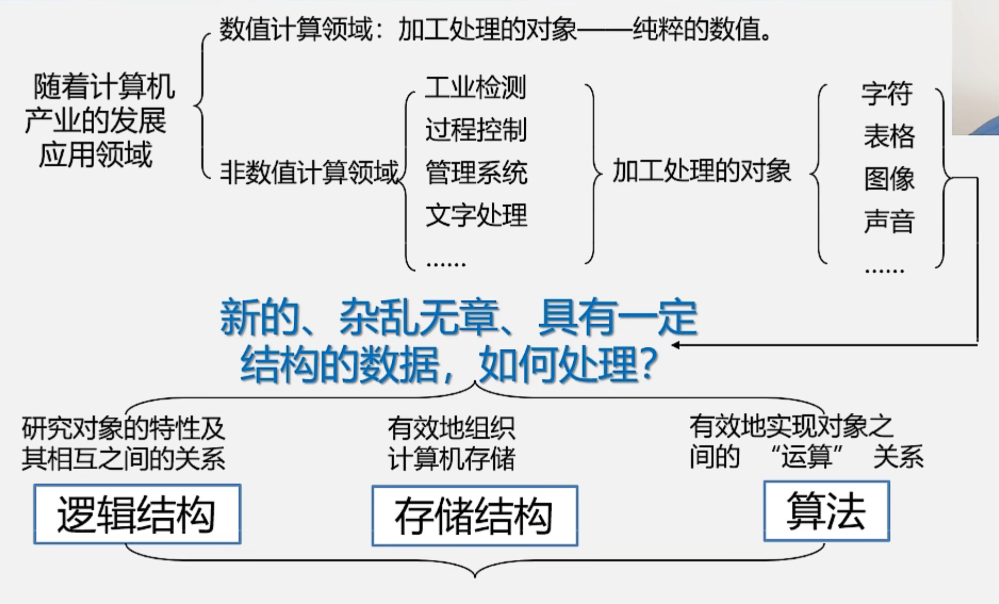
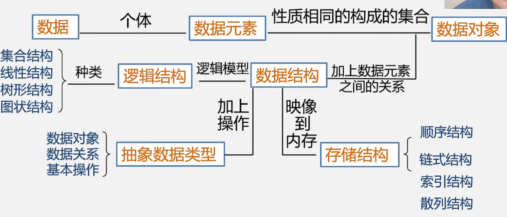
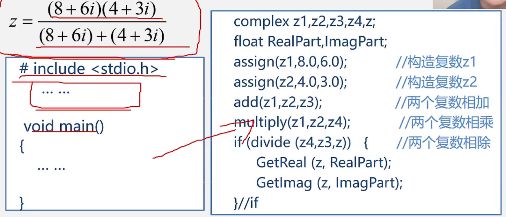

# 三、抽象数据类型的表现和实现

复习：

## 1.抽象数据类型如何实现

一个问题抽象为一个抽象数据类型后，仅是形式上的抽象定义，还没有达到问题解决的目的，要实现这个目标，就要把抽象的变为具体的，即抽象数据类型在计算机上实现，变成一个能用的具体的数据类型。

C语言实现抽象数据类型：
		用已有的数据类型定义描述它的存储结构
		用函数定义描述它的操作

- 抽象数据类型可以通过固有数据类型（如整型、实型、字符型等）来表示和实现。

  - 即利用处理器中已存在的数据类型来说明新的结构，用已经实现的操作来组合新的操作

- 注：**本课程中我们使用==类C语言==（介于伪代码和C语言之间）作为描述工具**

- 但上机时要用具体语言实现，如C或C++等

- 用C语言==真正实现==抽象数据类型

  例如：抽象数据类型“复数”的实现

  ~~~c
  typedef struct{
  	float realpart			/*实部*/
  	float imaqpart			/*虚部*/
  }Complex					/*定义复数抽象类型*/
  void assign(Complex *A,float real,float imag);		/*赋值*/
  void add(Complex *A,float real,float imag);			/*A + B*/
  void minus(Complex *A,float real,float imag);		/*A - B*/
  void divide(Complex *A,float real,float imag);		/*A / B*/
  
  void assign(Complex *A,float real,float imag){
      A->realpart = real;		/*实部赋值*/
      A->imagpart = imag;		/*虚部赋值*/
  }							/*End of assign()*/
  
  void add(Complex *c,Complex *A,Complex B){			/*c = A + B*/
      c->realpart = A.realpart + B.realpart;			/*实部相加*/
      c->imagpart = A.imagpart + B.imagpart			/*虚部相加*/
  }													/*End of assign()*/
  /************************
  注：Complex是我们定义的一个结构体类型
  带*：指针变量，它是指向Complex类型的指针
  不带*：Complex类型的普通变量
  ************************/
  ~~~

  