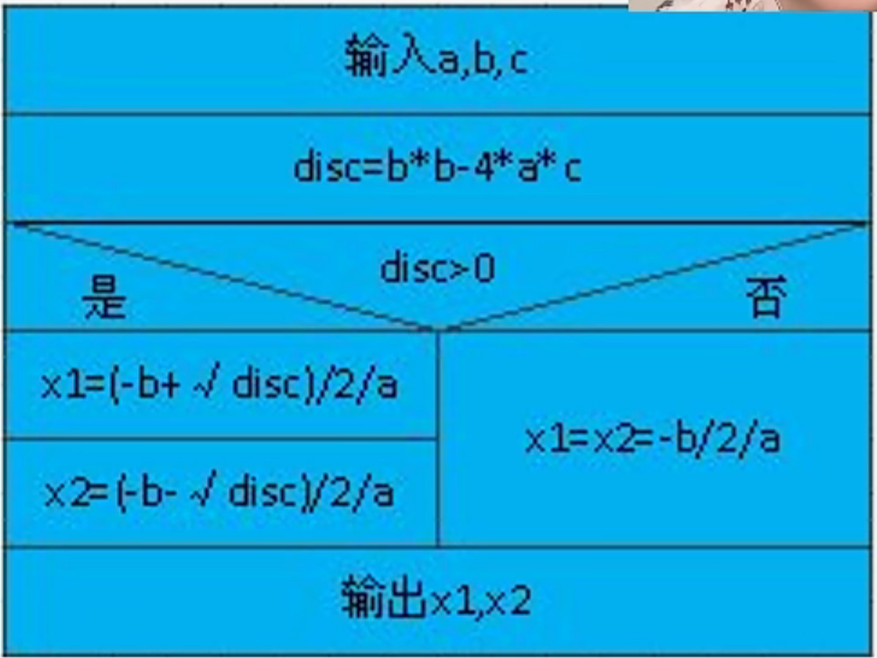

# 算法和算法分析

## 1.算法

- 算法的定义

  - 对特定问题**求解方法和步骤**的一种描述，它是==指令==的有限==序列==。其中每个指令表示一个或多个操作，简而言之，**算法就是解决问题的方法和步骤**

- 算法的描述

  - ==自然语言==：英语、中文

    

  - ==流程图==：传统流程图、NS流程图

    
    

  - ==伪代码、类语言==：C语言

  - ==程序代码==：C语言程序、JAVA语言程序……

- 算法和程序

  - ==算法==是解决问题的一种方法或一个过程，考虑如何将输入转换成输出，一个问题可以有多种算法
  - ==程序==是用某种程序设计语言对算法的具体实现
    - 程序 = 数据结构 + 算法
    - 数据结构通过算法实现操作
    - 算法根据数据结构设计程序

- 算法特性：一个算法必须具备以下五个重要==特性==

  - 有穷性：一个算法必须总是在执行有穷步之后结束，且每一步都在有穷时间内完成
  - 确定性：算法中的每一条指令必须有确切的含义，没有二义性，在任何条件下，只有唯一的一条执行路径，即对于相同的输入只能得到相同的输出
  - 可行性：算法是可执行的，算法描述的操作可以通过以实现的基本操作执行有限次数来实现
  - 输入：一个算法有零个或多个输入
  - 输出：一个算法有一个或多个输出

- 算法设计的要求

  - 正确性(Correctness)

    

  - 可读性(Readability)

    

  - 健壮性(Robustness)，又称鲁棒性

    

  - 高效性(Efficiency)

    

## 2.算法分析

- 算法分析：算法分析的目的是看算法时机是否可行，并在同一问题存在多的算法时进行性能上的比较，以便从中挑选出比较优的算法
- 如何分析

  - 一个好的算法首先要具备正确性，然后是健壮性，可读性，在几个方面都满足的情况下，主要考虑**算法的效率**通过算法的效率高低来评判不同算法的优劣程度
  - 算法效率通过以下两个方面来考虑：
    - 时间效率：指的是算法所耗费的**时间**
    - 空间效率：指的是算法执行过程中所耗费的**存储空间**
    - **时间效率和空间效率有时候是矛盾的**

## 3.时间复杂度的分析

- **算法时间效率的度量**

  - 算法时间效率可以用该算法所编制的程序在计算机上**执行所消耗的时间**来度量

  - 两种度量方式：

    - ==事后统计==

      - 将算法实现，测算其时间和空间开销
      - **缺点**：
        编写程序实现算法将耗费较多的时间和精力
        所得实验结果将依赖于计算机的软硬件等环境因素，掩盖算法本身的劣势

    - ==事前分析==

      - 对算法所消耗资源的一种估算方法

      - ==事前分析方法==：

        一个算法的运行时间是指一个算法在计算机运行所耗费的时间大致可以等于计算机执行的一种简单操作（如赋值、比较、移动等）所需的**时间**与算法中进行的简单操作**次数**==乘积==

        ​						算法执行时间 = 一个简单操作所需的时间 $\times$ 简单操作次数

        也即算法中每条语句的执行时间和

        ​						算法执行时间 = $\sum$每条语句的执行次数 $\times$ 该语句执行一次所需的时间

        ​						语句的执行次数 = 语句频度

        ​						==算法执行时间 = $\sum$每条语句频度 $\times$ 该语句执行一次所需的时间==

        >​	每条语句执行一次所需的时间，一般是随机器而异的。取决于机器的指令性能、速度以及编译的代码质量。它是由机器本身的软硬件环境决定的，与算法无关。
        >
        >​	所以，我们可以**假设执行每条语句所需的时间均为**==单位时间==。此时对算法的运行时间的讨论就可转化为讨论该算法中所有语句的执行次数，即频度之和了。

        例如：两个n$\times$n矩阵相乘的算法可描述为：

        ~~~c
        for(i=1;i<=n;i++){									//n+1次,除了从1到n的n次循环，还要判断一次i=n+1时，下面的同理
        	for(j =1;j <= n;j++){							//n(n+1)次
        		c[i][j] = 0;								//n*n次
        		for(k = 0;k<n;k++)							//n*n*(n+1)次
        			c[i][j] = c[i][j] + a[i][k] * b[k][j];	//n*n*n次
        	}
        }
        ~~~

        我们把算法所耗费的时间定义为**该算法中每条语句的频度之和**，则上述算法的时间消耗T(n)为：

        ​							$T(n)=2n^3+3n^2+2n+1$

      - 算法时间复杂度的渐进表示法

        为了便于比较不同算法的时间效率，我们仅比较它们的数量级

        ​			例如：两个不同的算法，时间消耗分别是：$T(n)=10n^2$与$T(n)=n^3$，前者比后者好

        若有某个辅助函数f(n)，使得当n趋近于无穷大时，T(n)/f(n)的极限值为**不等于零的常数**，则称f(n)是T(n)的同数量级函数。记做T(n)=O(f(n))，称O(f(n))为**算法的渐进时间复杂度** *（O是数量级的符号）*，简称**时间复杂度**。

        对于刚刚矩阵相乘的问题，算法耗费时间：$T(n)=2n^3+3n^2+2n+1$，则T(n)可记做==$T(n)=O(n^3)$==

        一般情况下，不必计算所有操作的执行次数，而只考虑算法中**基本操作**执行的次数，他是问题规模n的某个函数，用T(n)表示。

- 算法时间复杂度定义

  **算法中==基本语句重复执行的次数==是==问题规模n==的某个函数f(n)，算法的时间量度记做：==T(n)=O(f(n))==**

  >**表示随着n的增大，算法执行的时间增长率和f(n)的增长率相同，称为==渐进时间复杂度==**

  

  > 基本语句的特点：
  >
  > - 算法中重复执行次数和算法的执行时间成正比的语句
  > - 对算法运行时间的贡献最大
  > - 执行次数多
  >
  > 问题规模n，n越大算法执行时间越长
  >
  > - 排序：n为记录数
  > - 矩阵：n为矩阵的阶数
  > - 多项式：n为多项式的项数
  > - 集合：n为元素个数
  > - 树：n为树的结点个数
  > - 图：n为图的顶点数或边数

  - 总结：

    定理1：若$f(n)=a_nn^m+a_{m-1}n^{m-1}+……+a_1+a_0$是m次多项式，则$T(n)=$ ==$O(n^m)$==
    即，忽略所有**低次幂项和最高次幂系数**，体现出增长率的含义

- 分析算法时间复杂度的基本方法

  - 找出**语句频度最大**的那条语句作为**基本语句**
  - 计算**基本语句**的频度得到问题规模n的某个函数f(n)
  - 取其数量级用符号“O”表示
  - 例：**时间复杂度是由嵌套最深的语句的频度决定的**

  

  

  - 注意：有的情况下，算法的基本操作重复执行的次数还随着问题的**输入数据集**有所不同

    例：顺序查找

    

  - 所以就有了最坏时间复杂度、平均时间复杂度、最好时间复杂度

    - **最坏时间复杂度**：指在最坏的情况下，算法的时间复杂度
    - **平均时间复杂度**：指在所有可能输入实例在等概率出现的情况下，算法的期望运行时间
    - **最好时间复杂度**：指在最好情况下，算法的时间复杂度
    - 一般总是考虑在最坏的情况下的时间复杂度，以保证算法的运行时间不会比它更长

  - **对于复杂的算法，可以将它分成几个容易估算的部分，然后利用大O加法法则和乘法法则，计算算法的时间复杂度**

    - 加法法则

      $T(n)=T1(n)+T1(n)=O(f(n))+O(g(n))=O(max(f(n),g(n)))$

    - 乘法法则

      $T(n)=T1(n)\times T1(n)=O(f(n))\times O(g(n))=O(f(n)\times g(n))$

- 算法时间效率比较

  - 当n取的很大时，指数时间算法和多项式时间算法在所需时间上非常悬殊

    

## 4.空间复杂度的分析

- 渐进空间复杂度

  - 空间复杂度：算法所需的存储空间的度量，记做：**S(n) = O(f(n))**，其中**n**为问题规模或大小

  - 算法要占据的空间

    - 算法本身占据的空间，输入输出，指令，常数，变量等
    - 算法要使用的**辅助空间**

  - 例：

    

## 5.设计好算法的过程

