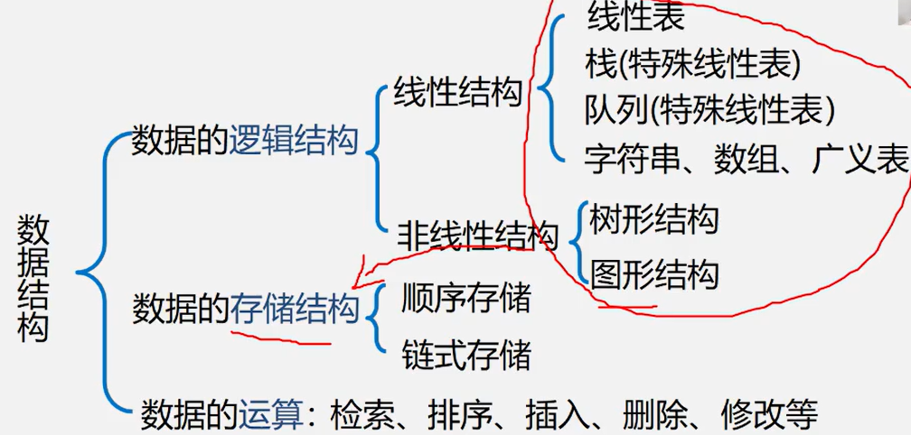
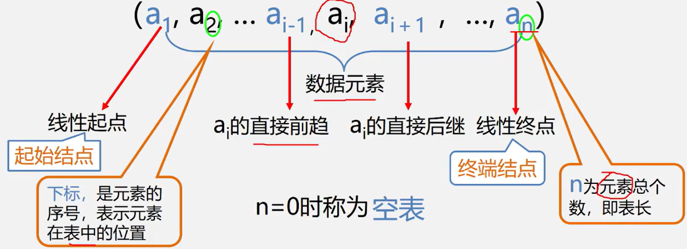

知识回顾：

# 线性表的定义和特点

## 1.定义

- **线性表**：由==n(n$\ge$0)==个数据元素（结点）$a_1$、$a_2$、……、$a_n$组成的==有限序列==

  - 其中数据元素的个数n定义为表的**长度**
  - 当n=0时称为**空表**
  - 将非空的线性表（n>0）记做：（$a_1$、$a_2$、……、$a_n$）
  - 这里的数据元素$a_i$(1$\le$i$\le$n)只是一个抽象的符号，其具体含义在不同的情况下可以不同

  

- 例子：

  - 某单位历年拥有的计算机数量（6，17，28，50，92，188）

  **同一线性表中的元素必定具有相同特性，数据元素间的关系是线性关系**

##2. 特征

- 线性表的逻辑特征是

  - 在非空的线性表中，有且只有一个开始结点$a_1$，它没有直接前趋，而仅有一个直接后继$a_2$
  - 有且仅有一个终端结点$a_n$，它没有直接后继，而仅有一个直接前趋$a_{i+1}$

  **线性表是一种典型的线性结构**

