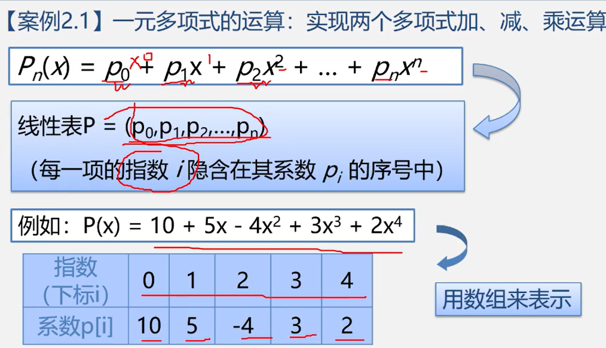
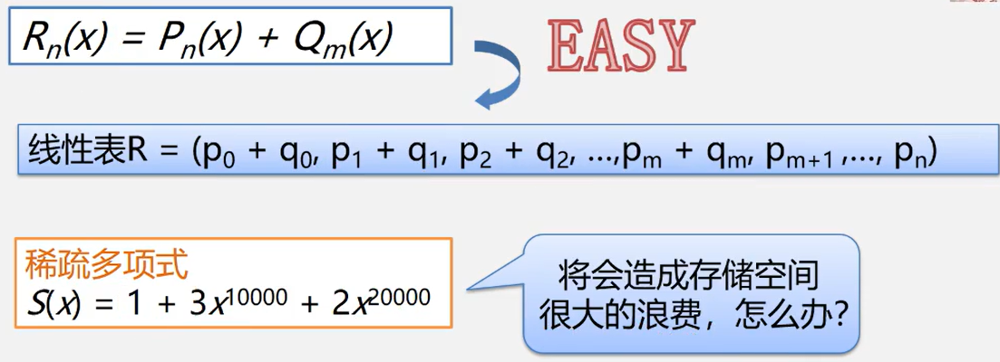
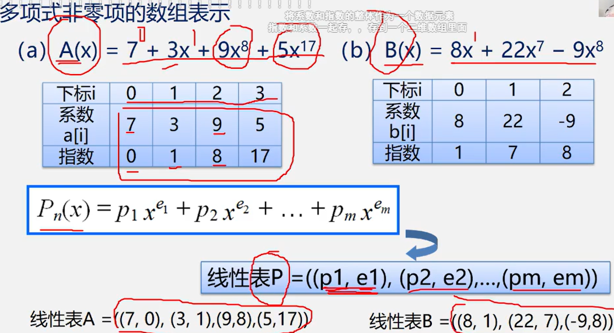
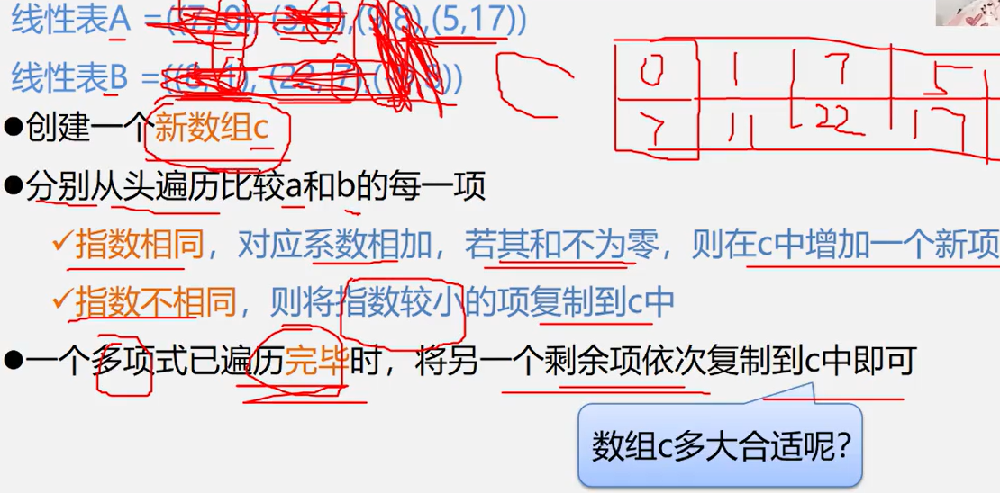
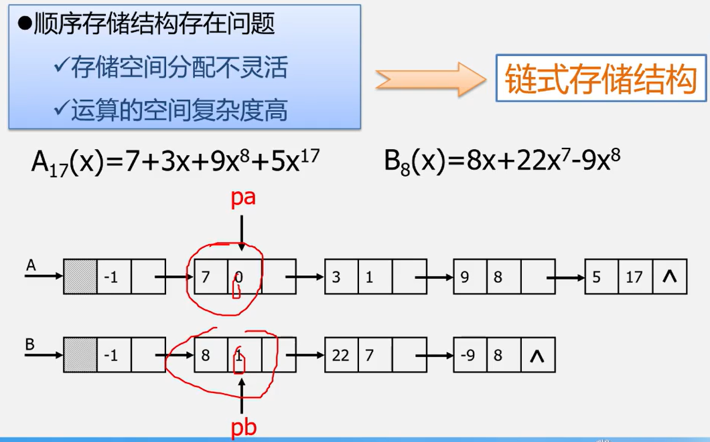
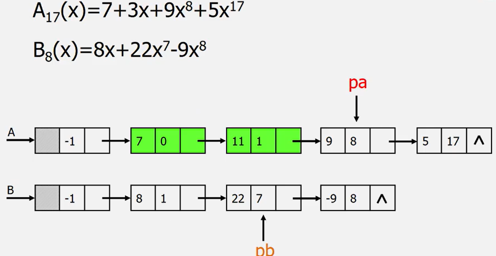
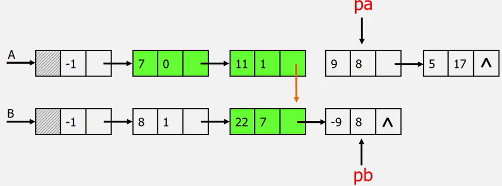
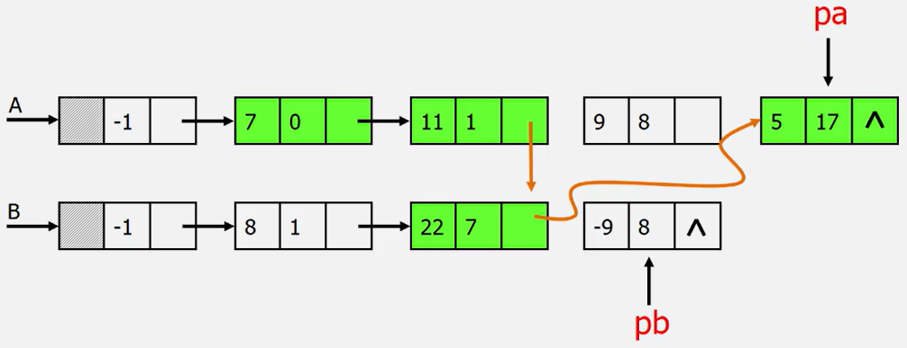
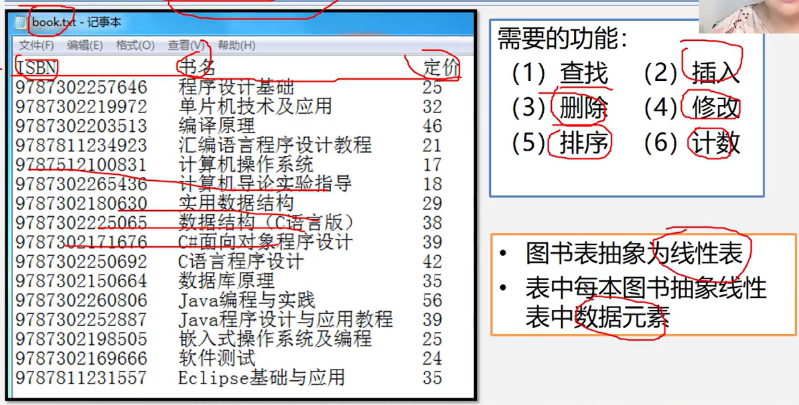
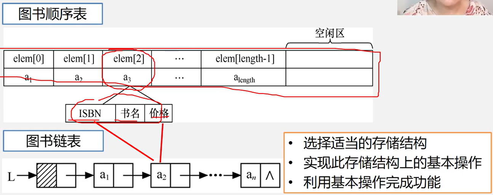

# 一、案例引入

## （一）、一元多项式的运算

## （二）、稀疏多项式的运算

### 1.使用顺序存储结构

### 2.使用链表

##（三）、图书信息管理系统

## （四）、总结

- 线性表中数据元素的类型可以为**简单类型**，也可以为**复杂类型**
- 许多实际应用问题所设计的基本操作有很大的相似性，不应为每个具体应用单独编写一个程序
- 从具体应用中抽象出共性的**逻辑结构和基本操作**（抽象数据类型），然后实现其**存储结构和基本操作**
