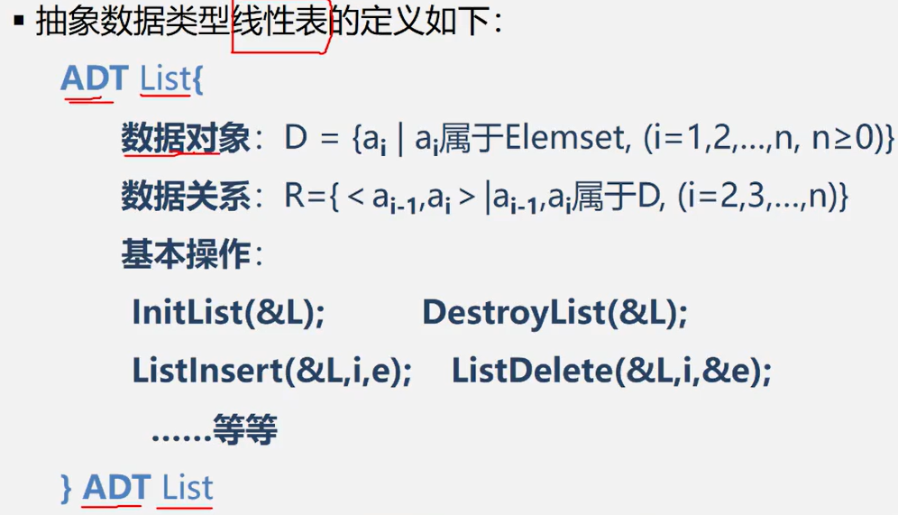

# 线性表的类型定义

##（一）、抽象数据类型线性表的定义：

## （二）、基本操作

###基本操作（一）

- InitList(&L)              (Initialization  List)
  - 操作结果：构造一个空的线性表L

- DestroyList(&L)
  - 初始条件：线性表L已经存在
  - 操作结果：销毁线性表L
- ClearList(&L)
  - 初始条件：线性表L已经存在
  - 操作结果：将线性表L重置为空表

### 基本操作（二）

- ListEmpty(L)
  - 初始条件：线性表L已经存在
  - 操作结果：若线性表L为空表，则返回TURE，否则返回FALSE
  
- ListLength(L)

  - 初始条件：线性表L已经存在

  - 操作结果：返回线性表L中数据元素的个数

### 基本操作（三）

- GetElem(L,i,&e)

  - 初始条件：线性表L已经存在，1 <= i <= ListLength(L)

  - 操作结果：用e返回线性表L中第i个数据元素的值

- LocateElem(L,e,compare())

  - 初始条件：线性表L已经存在，compare()是数据元素的判定函数

  - 操作结果：返回L中第1个与e满足compare()的数据元素的位序。若这样的数据元素不存在则返回值为0

### 基本操作（四）

- PriorElem(L,cur_e,&pre_e)

  - 初始条件：线性表L已经存在

  - 操作结果：若cur_e是L的数据元素，且不是第一个，则用pre_e返回它的前驱；否则操作失败，pre_e毫无意义

- NextElem(L,cur_e,&next_e)

  - 初始条件：线性表L已经存在

  - 操作结果：若cur_e是L的数据元素，且不是最后一个，则用next_e返回它的后继；否则操作失败，next_e毫无意义

### 基本操作（五）

- ListInsert(&L,i,e)

  - 初始条件：线性表L已经存在，1 <= i <= ListLength(L)+1

  - 操作结果：在L的第i个位置之前插入新的数据元素e，L的长度加一

- ListDelete(&L,i,&e)

  - 初始条件：线性表L已经存在，1 <= i <= ListLength(L)

  - 操作结果：删除L的第i个数据元素，并用e返回其值，L的长度减一

- ListTraverse(&L,visited())

  - 初始条件：线性表L已经存在

  - 操作结果：依次对线性表中每个元素调用visited()