# 一、线性表的顺序存储表示

## （一）、顺序存储结构

###1.定义

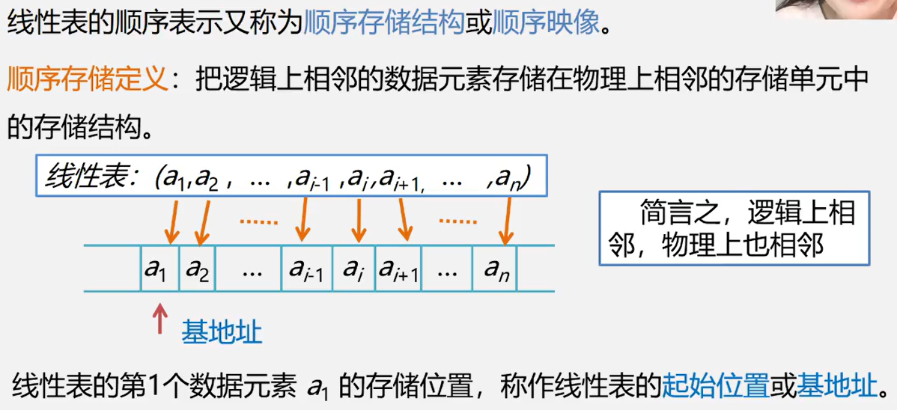

### 2.顺序表中元素存储位置的计算

线性表顺序存储结构**占用一片连续的存储空间**，知道某个元素的存储位置就可以计算其他元素的存储位置

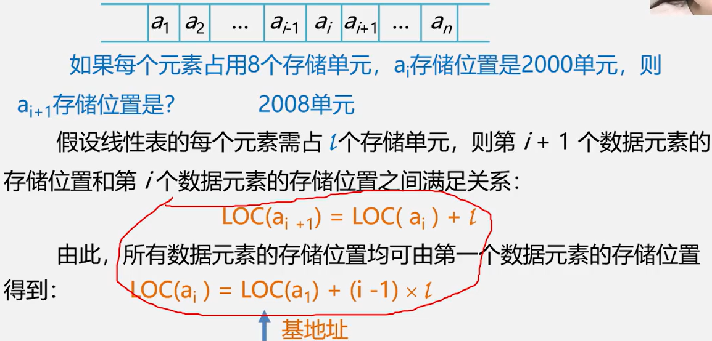

## （二）、实现方式

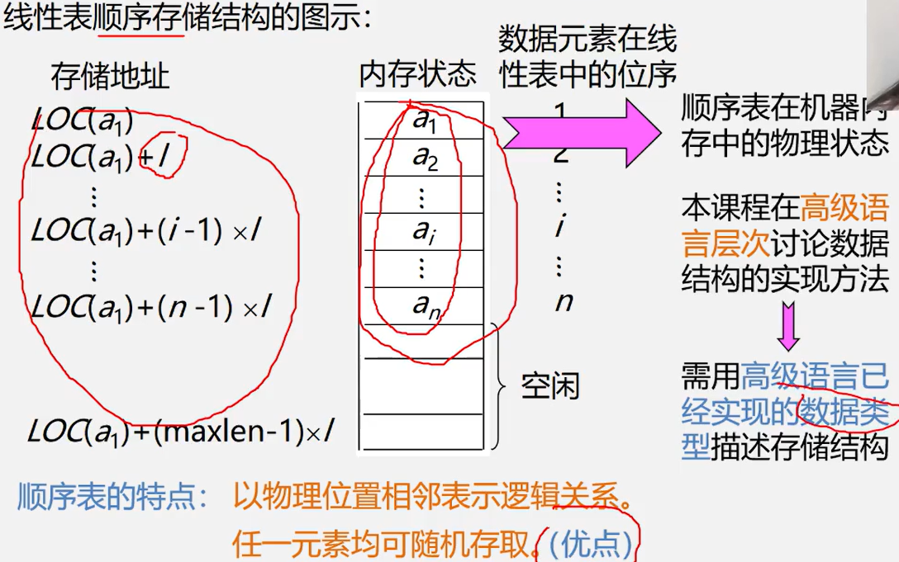

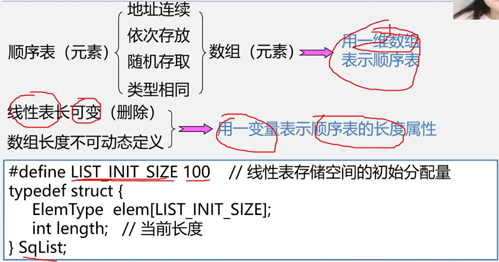

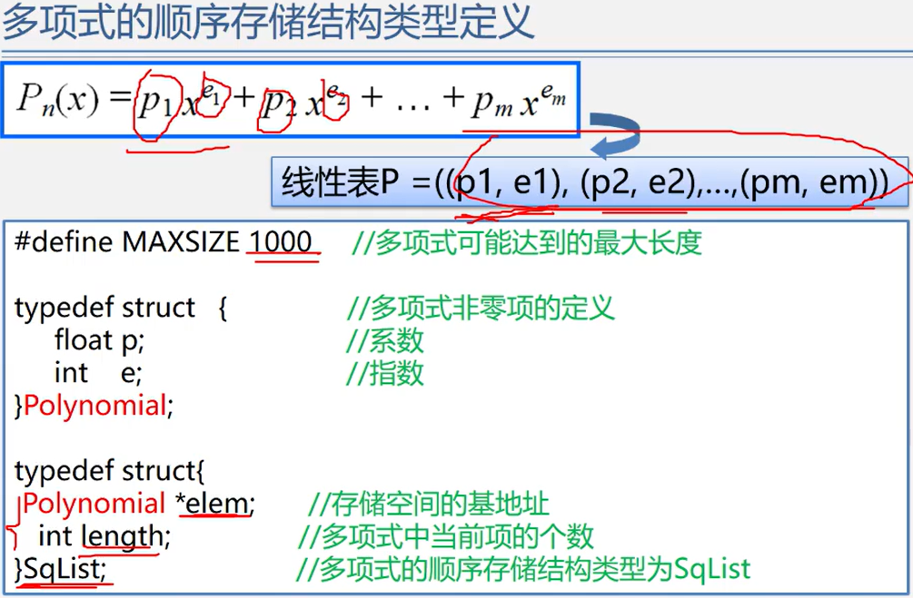

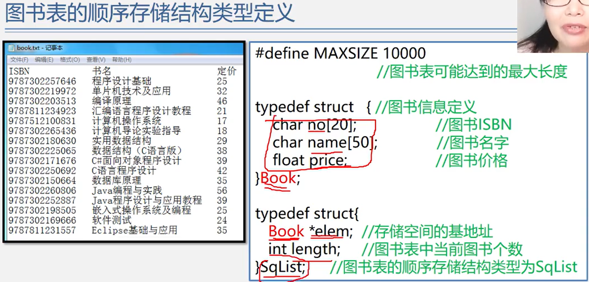

# 二、类C语言有关操作补充

## 1.元素类型说明

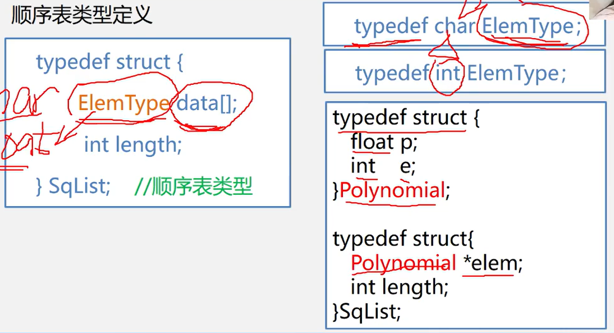

## 2.数组定义

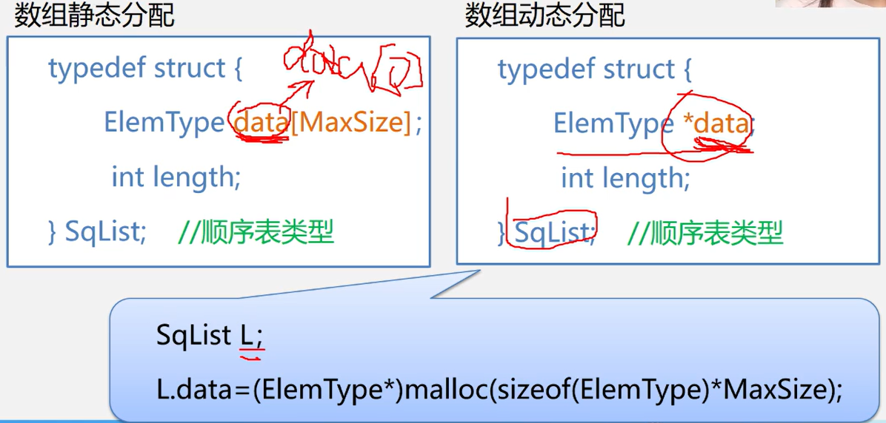

## 3.C语言的内存动态分配

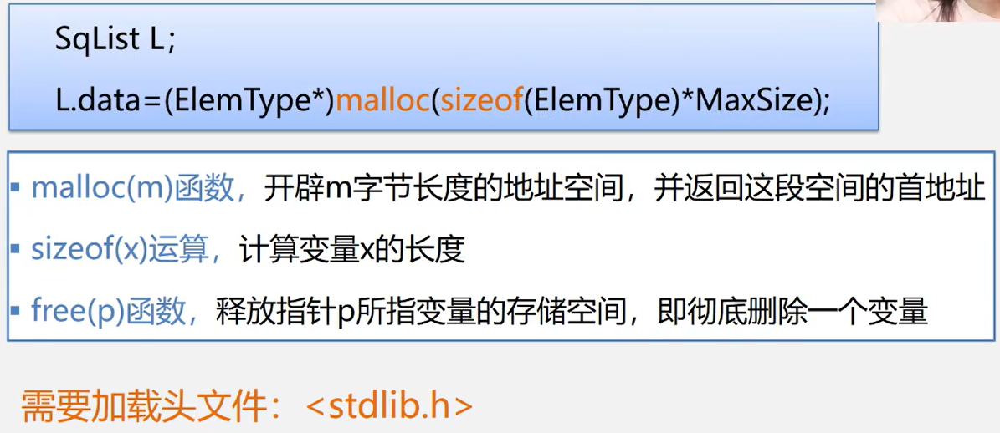

sizeof(ElemType)：计算ElemType这种类型的字节长度

sizeof(ElemType) * MaxSize：计算总共需要分配多少字节空间

malloc(sizeof(ElemType) * MaxSize)：开辟sizeof(ElemType) * MaxSize字节长度的空间

(ElemType*)：强制转换成指向ElemType类型的指针

## 4.C++的动态存储分配

## 5.C++中的参数传递

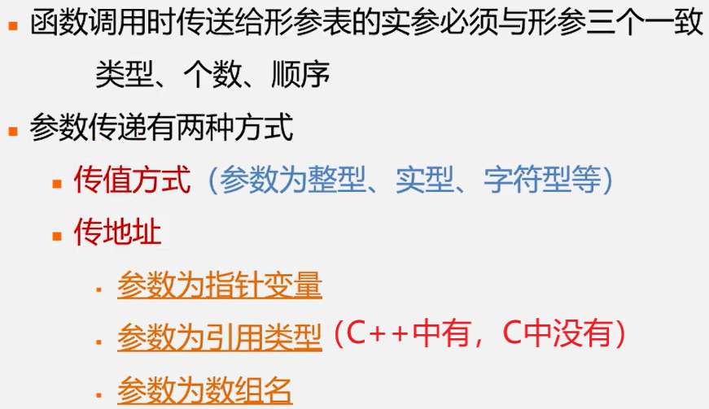

###1.传值方式

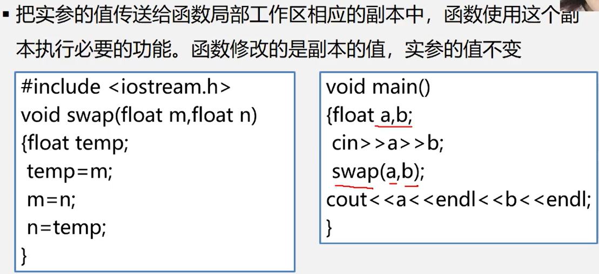

###2.传地址方式——指针变量作参数

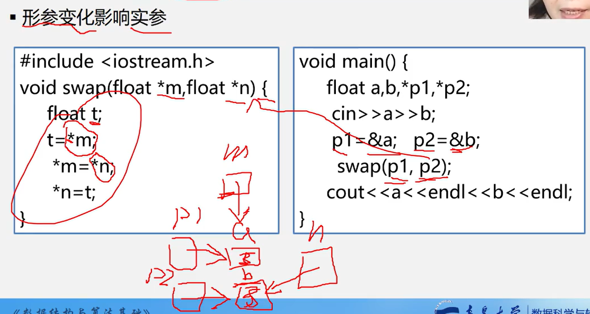

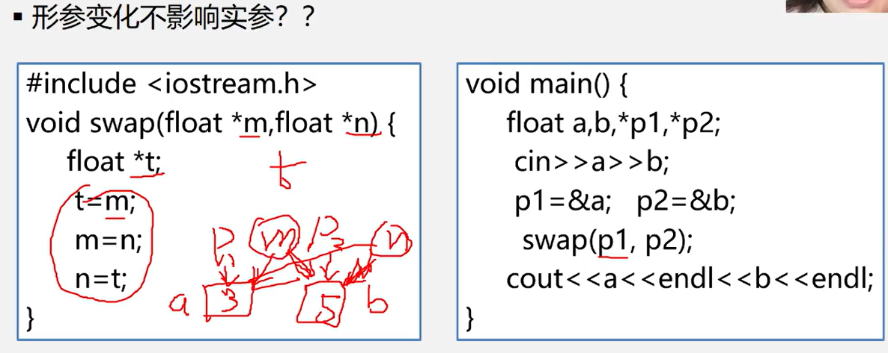

### 3.传地址方式——数组名作参数

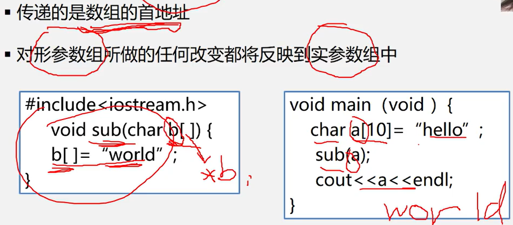

### 4.传地址方式——引用类型作参数

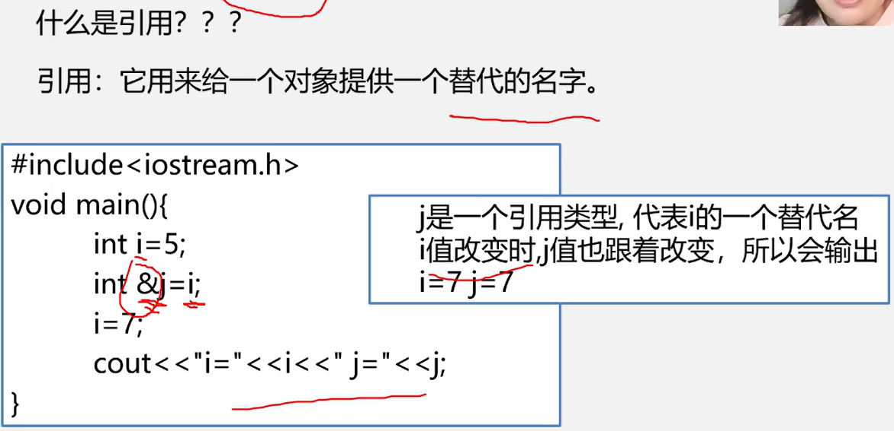

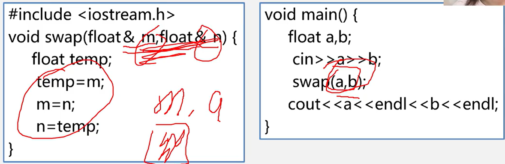

引用类型做形参的三点说明：

- 传递引用类型给函数和传递指针的效果是一样的，**形参变化，实参也发生变化**
- 引用类型做形参，在内存中没有产生实参的副本，它**直接对实参操作**，而一般变量做参数，形参与实参就占用不同的存储单元，所以**形参变量的值是实参变量的副本**。因此，当**参数传递的数据量较大**时，用引用类型比用一般变量传递参数的时间和空间效率都要好
- 指针参数虽然也能达到与使用引用类型的效果，但在被调函数中需要重复使用“*指针变量名”的形式进行运算，这很容易产生错误且程序的阅读性较差；另一方面，在主函数的调用处，必须使用变量的地址作为实参