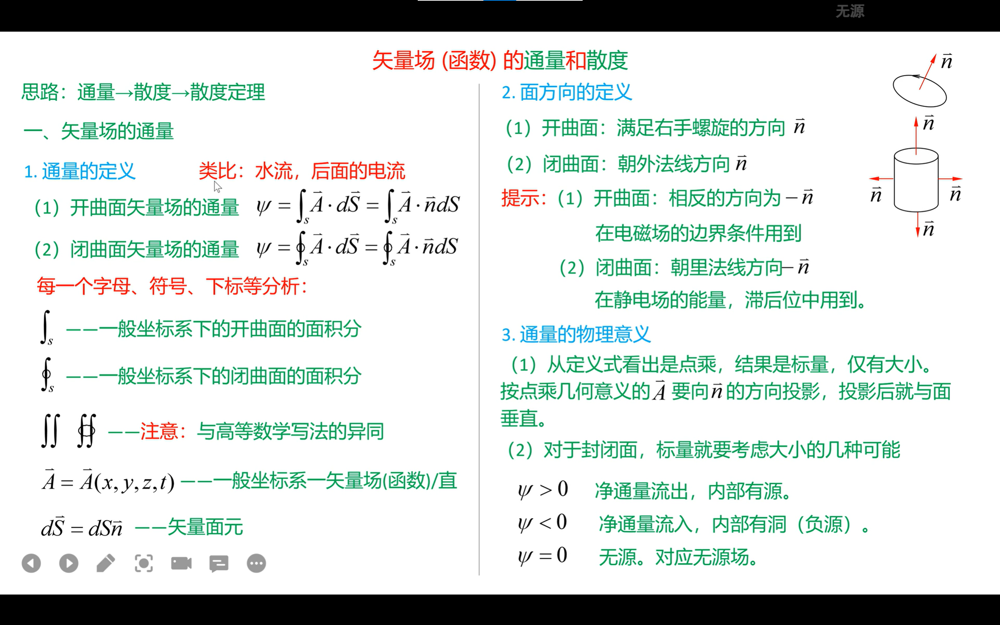
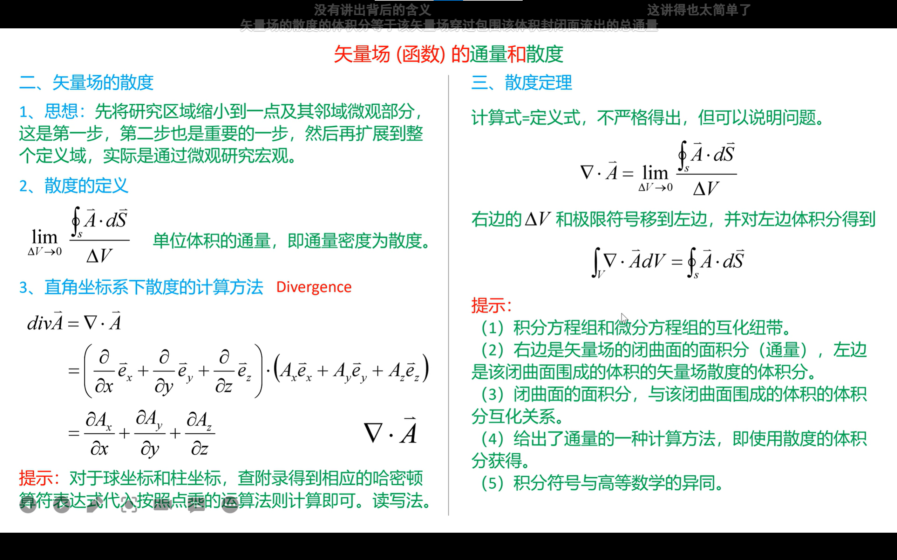

[散度与旋度：麦克斯韦方程组、流体等所用到的语言_哔哩哔哩_bilibili](https://www.bilibili.com/video/BV19s41157Z4/?spm_id_from=333.851.header_right.history_list.click&vd_source=ba89c885857d57586a8c5ab992d5927d)

[（双语）Divergence Theorem (高斯散度定理) by MIT's Experimental Study Group_哔哩哔哩_bilibili](https://www.bilibili.com/video/BV1ca4y1x7sA/?spm_id_from=333.851.header_right.history_list.click&vd_source=ba89c885857d57586a8c5ab992d5927d)

2:10~4:25关于旋度定理

[旋度定理和散度定理的可视化证明_哔哩哔哩_bilibili](https://www.bilibili.com/video/BV1444y1N762/?from=search&seid=6674093705717571307&spm_id_from=333.337.0.0&vd_source=ba89c885857d57586a8c5ab992d5927d)
